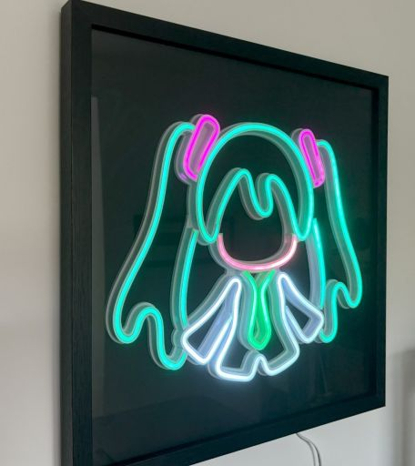

# Customisable LED Picture ornament

For Pi Pico W.

Includes HTTP configuration page and Home-assistant integration via MQTT.

Contains some example double-buffered animations and a basic framework for defining more.

## Why?

I found a way to use a very simple Pio program to drive WS2812B led pixels with extremely low overhead.
This was just me building something to try it out on. Can be re-configured as an LED ornament of your choice...

## Equipent/Materials needed

* 4mm Silicone side-lit LED profile - e.g. https://www.aliexpress.com/item/1005004451720515.html
* 5mm WS2812B LED strip - e.g. https://www.aliexpress.com/item/1005006937738626.html
* 3D printer for the profiles
* Box picture frame to mount it in

## Building

* models/ - Fusion 360 models & STLs for printing.

The parts of the model are separated into a puzzle shape to make printing possible.
Careful alignment of the pieces (i.e. rotating the model) will allow printing on 20x20cm bed.

Wire in +5v to VSYS, GND to any ground pin, and Data to Pin 4 (or reconfigure code to use another pin).
Wiring the 5mm LED tape is extremely fiddly. Make sure +5V and GND are wired directly to a few places
to avoid voltage drop across the string of LEDs. Data needs to be a single path through all the LEDs.

Even if you print my STL files it's unlikely you'll get exactly the same number of LEDs in your profiles
so you'll need to adjust the data or re-map it entirely.

The firmware can be built from a devcontainer. There is a separate devcontainer for the web-interface to simplify the React development.
Run generate_fsdata.sh from the firmware devcontainer to build the web interface data before building the firmware.

Load the firmware onto your Pico W.

## Configuring

The Pico will initially start in Wifi Server mode. Connect to the Pico's wifi hotspot. Go to 192.168.4.1 to view the configuration web page. From here, connect it to your wifi and reboot.

Add MQTT settings as required to enable the Home Assistant integration.

## How the code works

* firmware/ - Over-complicated Pico firmware for driving the picture with various animations
* web-interface/ - Basic react UI for configuring
* utils/ - Hacked together script for mapping pixel positions from a video of the pixel mapper animation

The Pico is over-powered for this task. We use the second core for running the animations exclusively. The animation thread will call DrawFrame periodically. You can write to the current frame and read the previous frame for animation effects.

The animations determine their frame rate by specifying a frame delay. 60FPS works well, and leaves a lot of headroom 
for running complex animation effects.

Examples of 3 possible techniques are included:

1. LED indexing by strip position
1. Setting colour based on pixel position
1. Wasteful approach of drawing into a rectangular image buffer, and mapping from that to pixel. This is easier for some complex drawing effects.

There is an over-complicated, under-powered framework built around `lwip` for MQTT and HTTP server support.

